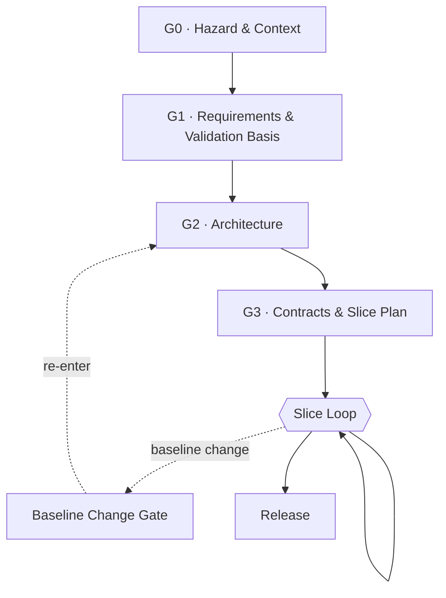

# Gate Overview

Four gates, then a loop. Gates are one-way doors ([P1](../00-principles.md)); the loop
is where reversible work happens.

| Gate | Question it answers | Primary artifact | Classic equivalent |
|---|---|---|---|
| G0 | What must this never do? | Hazard register | FHA |
| G1 | What must it do, and how will we know it is right? | Requirements + validation basis | SRR |
| G2 | What are the parts and how do they connect? | Module map + dependency manifest | PDR |
| G3 | What exactly does each part promise? | Contracts + conformance suites + slice plan | CDR |

## Gate rules

**A gate is passed when its artifacts exist and are reviewed, not when they are perfect.**
The purpose is to stop code depending on undecided things, not to achieve completeness.

**Every gate has a named human reviewer or an explicit note that it was self-reviewed.**
Self-review is permitted and normal for a single-operator project. Record it as such so
the confidence level is visible later.

**Gate artifacts are written for the reviewer you can actually get.** For G0–G2 that is
often a systems engineer who does not read code. One page, a Mermaid diagram, a hazard
list, and a decision log with rejected alternatives is a reviewable package. A codebase
is not.

**No gate produces a document that is never read again.** See [P6](../00-principles.md).

## What happens when a gate was wrong

It will be. Escalate through the [Baseline Change Procedure](../change-control/baseline-change-procedure.md),
which re-enters at G2 with a scoped re-review rather than restarting the project. The
modularity exists precisely to bound this.

## Gate detail

- [G0 — Hazard & Context](g0-hazard-context.md)
- [G1 — Requirements & Validation Basis](g1-requirements-validation-basis.md)
- [G2 — Architecture](g2-architecture.md)
- [G3 — Contracts & Slice Plan](g3-contracts.md)
- [Slice Loop](slice-loop.md)
