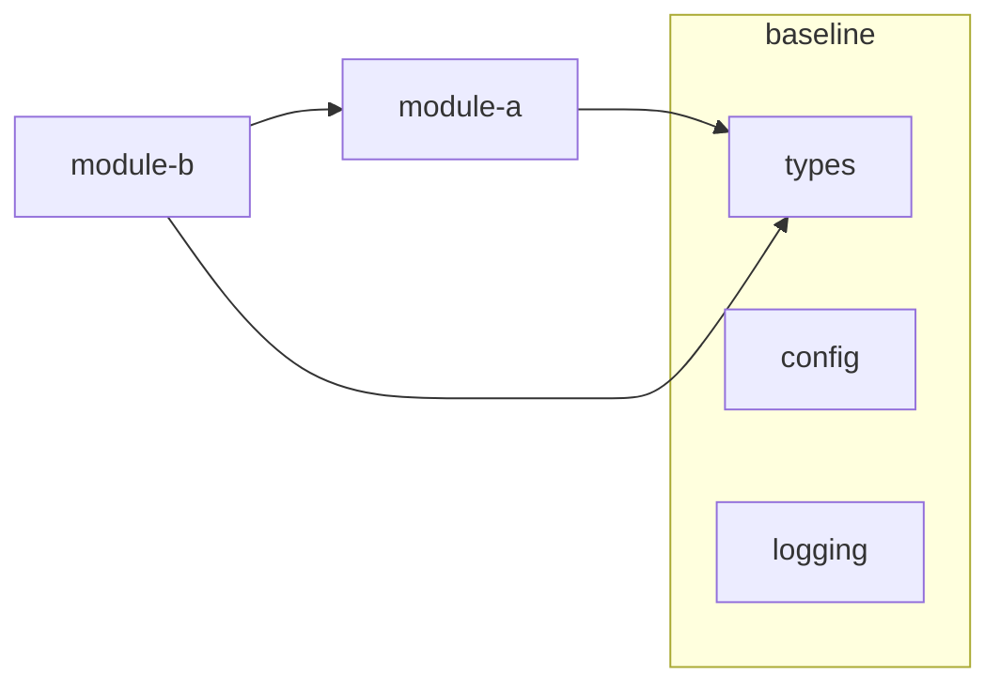

# G2 — Architecture

Answers: **what are the parts, how do they connect, and what is shared?**

Classic equivalent: PDR.

## Decomposition

Modules are defined by **what changes together**, not by what looks tidy. Two rules:

1. If a change to requirement X touches three modules, the decomposition is wrong.
2. If two modules always change together, they are one module.

Each module gets: a name, a one-sentence responsibility, its dependencies, and the
requirement IDs it satisfies. If the responsibility needs the word "and", split it or
justify it in a decision record.

## The dependency graph is two artifacts, not one

**Human-readable** — Mermaid, in this document. Renders in GitHub and VS Code, diffs as
text, reads fine to a model.

**Machine-checkable** — a dependency manifest per module listing permitted imports.
CI validates the actual import graph against the manifest.

Both are required, and they are not duplication in the [P3](../00-principles.md) sense:
the manifest is the source of truth, the diagram is a rendering. A CI check that the
diagram's edges match the manifest closes the gap. Without the manifest, the diagram
becomes decorative within a month.

## Baseline definition

The **baseline** is shared substrate every module inherits. Changing it is the most
expensive change in the system, so it is named explicitly at G2 and lives under
`baseline/`.

Baseline typically includes: shared types, persisted data schemas, configuration schema,
error and logging conventions, the module dependency graph itself, build and
distribution, and — where the profile has a UI — design tokens.

Anything in the baseline is subject to [CORE-CHG-002](../change-control/baseline-change-procedure.md).

## Profile selection

State which profile(s) this project instantiates and why. Profiles compose; a simulation
platform with a web UI is Simulation + Web, and **the contract between the two is the
most important interface in the project**. Name it here.

## Tech stack

Recorded as decision records ([CORE-DEC-001](../decisions/decision-log.md)), one per
significant choice, each with rejected alternatives. The rejected alternatives are the
valuable part — they are what stops you relitigating the decision at month four.

## Outputs

| Artifact | Consumed by |
|---|---|
| Module map (responsibility, dependencies, requirement IDs) | G3 |
| Mermaid dependency diagram | Human review |
| Dependency manifests | CI enforcement |
| Baseline definition | Change control |
| Profile selection + composition contract | G3 |
| Decision records for stack choices | Everything downstream |

## Exit criteria

- [ ] Every requirement allocated to exactly one module
- [ ] No circular dependencies
- [ ] Each module's responsibility expressible in one sentence
- [ ] Baseline explicitly enumerated
- [ ] Hazard mitigations from G0 allocated to modules
- [ ] Reviewed by a human other than you, if one is available at systems level
