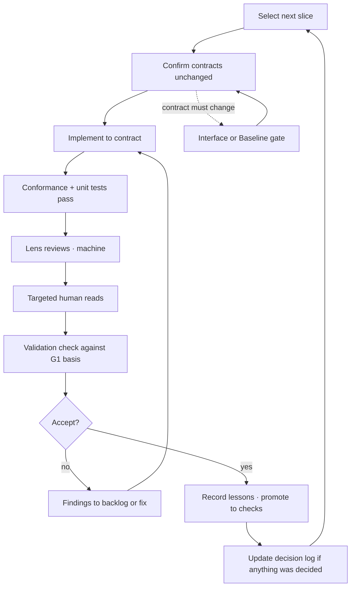

# Slice Loop

Where the work happens after G3. The loop answers "what do I do next" at every point,
which is its main job.

## Step notes

**Confirm contracts unchanged.** If the slice cannot be built within existing contracts,
stop and run the appropriate change gate ([CORE-CHG-001](../change-control/change-tiers.md)).
Do not quietly widen a contract mid-slice. This is the single most common way a
disciplined project degrades into an undisciplined one.

**Implement to contract.** Model work. You do not read this code line by line
([P5](../00-principles.md)).

**Lens reviews.** One lens per session, fresh context. See [CORE-REV-003](../reviews/lens-reviews.md).
Cheap, so run them narrowly and often rather than in one large pass at the end.

**Targeted human reads.** A short, specific list defined by the profile. See
[CORE-REV-004](../reviews/targeted-human-reads.md).

**Validation check.** Against the G1 validation basis, not against the tests. Tests
passing is verification. This step is the separate question of whether the output is
right ([P7](../00-principles.md)).

**Record lessons.** Every defect found by any route gets a lesson entry, and the entry
is immediately promoted to the strongest available check
([CORE-LSN-001](../lessons/lesson-ladder.md)). A defect that produced no check will
recur.

## Hands-on time

Ten minutes of actually using the thing, per slice. You are the only available judge of
whether it is usable, and no test covers it. Do this before acceptance, not after
release.

## Slice acceptance record

One short entry per slice: slice ID, requirements satisfied, hazard mitigations
verified, findings raised, lessons promoted, decision records created. This is the
project's audit trail and it takes two minutes to write at the point where you still
remember.

## Horizontal build-out

Only after the vertical slices covering the risky paths are accepted. Build-out is
lower-risk repetition and can be batched more aggressively — but each batch still passes
conformance and still gets a lens review.
