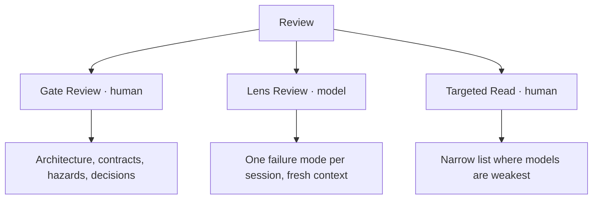

# Review Taxonomy

Three review classes, distinguished by **who reviews** and **what question is asked**.
They are not substitutes for each other and each catches defects the others cannot.

| Class | Reviewer | Question | Frequency | Detail |
|---|---|---|---|---|
| **Gate review** | Human | Is this the right thing to build, decomposed the right way? | Per gate | [CORE-REV-002](gate-reviews.md) |
| **Lens review** | Fresh model instance | Can this fail in *this specific way*? | Per slice, several lenses | [CORE-REV-003](lens-reviews.md) |
| **Targeted read** | Human | Is the thing models get wrong, wrong here? | Per slice, narrow list | [CORE-REV-004](targeted-human-reads.md) |

## The two axes

Every review sits on both:

**Verification or specification review** ([P7](../00-principles.md)). Does the
implementation satisfy the contract, or is the contract itself wrong? A single review that
tries to answer both answers neither. Two separate agents:
[verification-review](../../agents/verification-review.md) and
[specification-review](../../agents/specification-review.md). Validation, the third
activity of P7, is not a review class: it is a case under `validation/` against the G1 basis.

**Correlated or independent.** A model reviewing model-written code shares blind spots
with the author, particularly on domain assumptions and requirement interpretation.
Lens reviews are cheap and catch a great deal, but they do not substitute for the
targeted human read, and running more of them does not close a correlated gap.

## Why lens reviews are separated by failure mode

"Review this code" returns generic advice, because the model has no basis for
prioritisation and defaults to a plausible average of code review commentary. "You are
looking only for states in which this module can be left inconsistent after a partial
failure" returns real findings.

One lens per session. The lens library is in [`agents/`](../../agents/00-agent-index.md).

## Findings

All three classes feed one pipeline: [CORE-REV-005](review-findings-handling.md), which
defines admission — a failing test or a proposed clause — and the rejected list.
