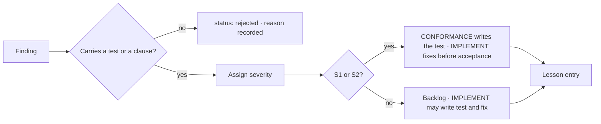

# Review Findings Handling

One pipeline for findings from all three review classes. Prevents two failures: a backlog
of plausible model output nobody can act on, and a failing test written by the session
that then fixes it. Read by REVIEW sessions recording findings and by whoever
dispositions them.

## Admission criterion

> A finding is admitted only if it carries a concrete artifact, in one of two forms,
> recorded in its `form` field.

| `form` | Artifact | Closes when |
|---|---|---|
| `test` | A test that fails on current code | The test passes |
| `clause` | A specific proposed change to a contract clause, requirement, hazard, or decision record | The named record changes; `ref` resolves to a version newer than the finding |

`clause` exists because validation and gate reviews run before there is code to fail
against; with a single form the framework's most valuable findings would be rejected by
rule. Both forms demand something a session can act on, which is what the filter is for.

Everything else is `status: rejected`, with a one-line reason. Findings are rows in
`trace/findings.yaml`; the schema is CORE-TRC-002. The rejected list is the rows with
`status: rejected`. It is kept, not discarded: a rejected finding that later turns out to
be real is a calibration signal about the reviewing agent's prompt.

## Severity

| Severity | Definition | Disposition |
|---|---|---|
| **S1** | Violates a hazard mitigation or produces silently wrong output | Blocks slice acceptance |
| **S2** | Violates a contract promise | Blocks slice acceptance |
| **S3** | Defect not covered by any contract promise | Backlog; consider whether the contract is incomplete |
| **S4** | Quality or maintainability | Backlog or reject |

## Applying the scale

The table above is the only definition. Agent prompts carry it verbatim as a generated
include (`<!-- include: CORE-REV-005#severity -->`, filled by `build_layer.py`) and map
lens-specific distinctions onto it rather than redefining it: output that differs between
identical runs is S1; timing-only divergence is S4 with a note.

An S3 finding should always trigger the question: *should the contract have promised
this?* If yes, it is really a validation finding: record it in `clause` form and run the
Interface sequence ([CORE-CHG-001](../change-control/change-tiers.md)).

## Who writes the failing test

Follows severity, because of [P8](../00-principles.md). S1 and S2 are by definition a
hazard mitigation or a contract promise, so their test is a conformance or validation
test: a CONFORMANCE session writes it from the clause the finding names, then an
IMPLEMENT session fixes ([CORE-SES-001](../session-protocol.md)). S3 and S4 are internal,
so an IMPLEMENT session may write test and fix together. A `fixed` S1 or S2 row names a
test under `conformance/` or `validation/` that exists and passes; the checker verifies it.

## Flow

## Every admitted finding produces a lesson

Immediately, at the point where you still remember the context. The lesson is then
promoted to the strongest available check ([CORE-LSN-001](../lessons/lesson-ladder.md)).
A defect that produced no check will recur — that is what "whack-a-mole" is.
