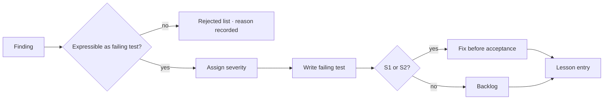

# Review Findings Handling

One pipeline for findings from all three review classes.

## Admission criterion

> A finding is admitted only if it can be expressed as a test that fails on current code.

Everything else goes to **considered and rejected**, with a one-line reason. This is not
bureaucracy — it is the filter that stops the backlog filling with plausible-sounding
model output that nobody can act on.

The rejected list is kept, not discarded. A rejected finding that later turns out to be
real is a calibration signal about the reviewing agent's prompt.

## Severity

| Severity | Definition | Disposition |
|---|---|---|
| **S1** | Violates a hazard mitigation or produces silently wrong output | Blocks slice acceptance |
| **S2** | Violates a contract promise | Blocks slice acceptance |
| **S3** | Defect not covered by any contract promise | Backlog; consider whether the contract is incomplete |
| **S4** | Quality or maintainability | Backlog or reject |

An S3 finding should always trigger the question: *should the contract have promised
this?* If yes, it is really a validation finding and the contract needs an Interface
change.

## Flow

## Every admitted finding produces a lesson

Immediately, at the point where you still remember the context. The lesson is then
promoted to the strongest available check ([CORE-LSN-001](../lessons/lesson-ladder.md)).
A defect that produced no check will recur — that is what "whack-a-mole" is.
