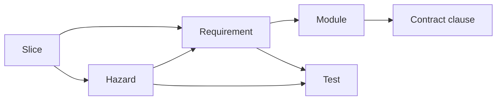

# Traceability

Trace tables written in prose are intentions. Nothing checks them, so a renamed test, a
deleted requirement, or a mitigation pointing at nothing stays invisible until it matters.

Hyperion holds traces as **structured data with a checker** ([P2](00-principles.md)).

## Where traces live

One directory per project, hand-maintained, committed:

```
trace/
  requirements.yaml    # what must be true, who owns it, what verifies it
  hazards.yaml         # what must never happen, and the control that prevents it
  slices.yaml          # what each slice claims to deliver
  tests.txt            # generated by test collection — never hand-edited
```

Format is deliberately flat: a list of records, scalar and inline-list values only. It
parses with no dependencies, diffs cleanly, and stays readable to a reviewer who does not
read code.

## The chain



Every link is checked. A break anywhere fails CI.

## What the checker enforces

    python tooling/check_traces.py

| Check | Why |
|---|---|
| IDs unique within each file | Silent overwrite of a requirement |
| Every requirement allocated to a module | An orphan requirement is nobody's job |
| Every requirement verified by ≥1 test | The commonest gap, and invisible without this |
| Every named test exists in `tests.txt` | Catches renames, which break traces silently |
| Every hazard names a contract and a test | A mitigation with no control is a statement of intent |
| `mitigation_status: verified` requires an existing test | Stops verified being claimed rather than earned |
| `TBD` test permitted only while `mitigation_status: proposed` | Makes TBD self-expiring at G3 |
| Slice references resolve | Catches a slice claiming a deleted requirement |
| Cross-references resolve everywhere | Catches deletion without cleanup |

`--strict` additionally fails on requirements not claimed by any slice. Use it from G3
onward, not before — unallocated requirements are normal until the slice plan exists.

## The test manifest

`tests.txt` is one test ID per line, generated by the test runner, never hand-edited:

    pytest --collect-only -q > trace/tests.txt      # example; toolchain-dependent

Generating it in CI immediately before the trace check is what makes a renamed test an
error rather than a silent gap. A hand-maintained manifest defeats the entire mechanism.

## The review artifact

    python tooling/check_traces.py --report > trace/matrix.md

Emits a requirement-by-requirement and hazard-by-hazard matrix in markdown.

This is the gate artifact for a reviewer who does not read code
([CORE-REV-002](reviews/gate-reviews.md)). A systems engineer can check that every hazard
has a control and every requirement has verification without reading a line of the
implementation, which is the highest-value external review available to a single-operator
project.

## Project CI

Order matters: collect tests first, or the manifest is stale and the check passes
against yesterday's test names.

```yaml
      - name: Traceability
        run: |
          <test-collection-command> > trace/tests.txt
          python hyperion/tooling/check_traces.py --strict
```

Use `--strict` from G3 onward. Before the slice plan exists, unallocated requirements are
normal and strict mode is noise.

## Discipline

Traces are updated **in the session that changes the thing being traced**, not batched.
A batched trace update is written from memory and is wrong.

Deleting a requirement means deleting or re-pointing everything that referenced it. The
checker will tell you what those are.
