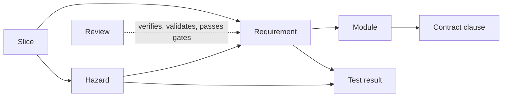

# Traceability

Trace tables written in prose are intentions. Nothing checks them, so a renamed test, a
deleted requirement, or a mitigation pointing at nothing stays invisible until it matters.
Read by anyone maintaining `trace/` and by the reviewer who receives the matrix.

Hyperion holds traces as **structured data with a checker** ([P2](../00-principles.md)).
The record schemas are [CORE-TRC-002](trace-records.md) (registers) and
[CORE-TRC-003](trace-logs.md) (logs and results). This document is the rationale.

## Where traces live

One directory per project, `trace/`, hand-maintained and committed, except
`results.xml`, which the test runner generates and which is never committed. Every
artifact the framework names as an output is a record here or prose under a template;
the table in [CORE-TRC-002](trace-records.md) says which ([P6](../00-principles.md)).

Records are deliberately flat: a list of mappings with scalar and inline-list values.
Flat records diff cleanly and stay readable to a reviewer who does not read code.

## The chain

Every link is checked. A break anywhere fails CI:

    python tooling/check_traces.py

Every resolution is against the thing itself, not a list of names: modules are found on
disk, clauses in the module's `CONTRACT.md`, tests in the runner's own results file.
There is no manifest to maintain and nothing that can be satisfied by typing.

## Strictness comes from the gate record

There is no strict flag. The checker reads `trace/reviews.yaml`: once a gate review
records G3 as passed, a `proposed` requirement or hazard is an error and an unclaimed
requirement is an error. Before that they are warnings, because unallocated
requirements are normal until the slice plan exists. Gate state lives in one table with
every other review, so "who reviewed what, when, with what disposition" is never in a
human's head or a CLAUDE.md.

## Results, not collection

A traced test must have **passed** in the run the results file records. A test that was
skipped, expected to fail, or failed is a trace break, not a pass. Only tests under
`modules/*/conformance/` or `validation/` may be traced; a unit test under `tests/` is
model-owned, written alongside the implementation, and cannot verify anything
([P8](../00-principles.md)). Generate the results immediately before the check, in CI
and locally, or the check passes against yesterday's run.

## The review artifact

    python tooling/check_traces.py --report          # plain-text matrix on stdout
    python tooling/build_console.py .                # console/index.html

The matrix is a view of the project console, one static HTML page rendered by
`tooling/build_console.py` from the checker's own data, with every other record, the
commit hash, and the checker's verdict in its header. It is built in CI on every run and
handed to the reviewer as one file; it is never committed and has no write path back to
any record. `--report` is the same matrix as plain text. Both open with the verdict: over
a broken chain they lead with the errors, `--report` exits non-zero, and the console
shows no green, so the artifact a reviewer receives states its own trustworthiness. This
is the gate artifact for a reviewer who does not read code
([CORE-REV-002](../reviews/gate-reviews.md)): a systems engineer can check that every
hazard has a control and every requirement has verification and validation without
reading the implementation.

## Discipline

Traces are updated **in the session that changes the thing being traced**, not batched.
A batched trace update is written from memory and is wrong.

Deleting a requirement means deleting or re-pointing everything that referenced it. The
checker will tell you what those are.
