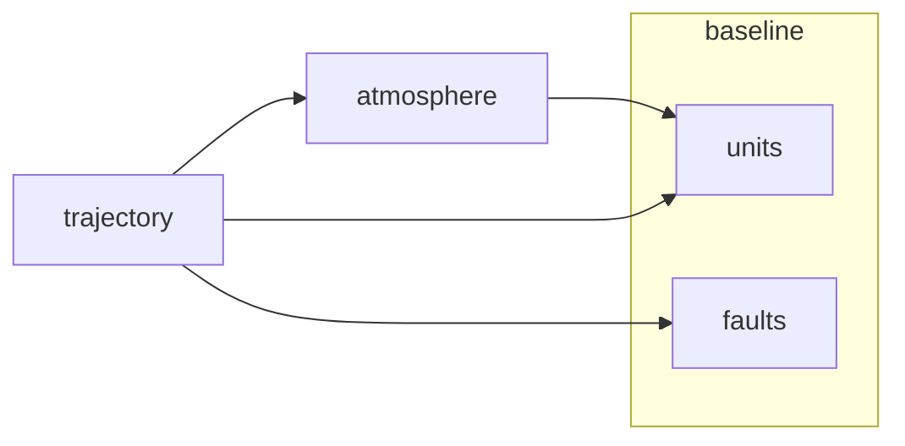

# Module map

The diagram is generated from `modules/*/manifest.yaml`; edit a manifest, not the diagram.

<!-- generated:module-map -->

<!-- /generated -->

| Module | Responsibility | Requirements |
|---|---|---|
| atmosphere | Report air density at a geometric altitude | REQ-001, REQ-003, REQ-005 |
| trajectory | Integrate a point-mass projectile with drag from launch to impact | REQ-002, REQ-004, REQ-005 |
| baseline | Unit-carrying types; the fault-point harness | REQ-005 (with atmosphere and trajectory), REQ-006 |
