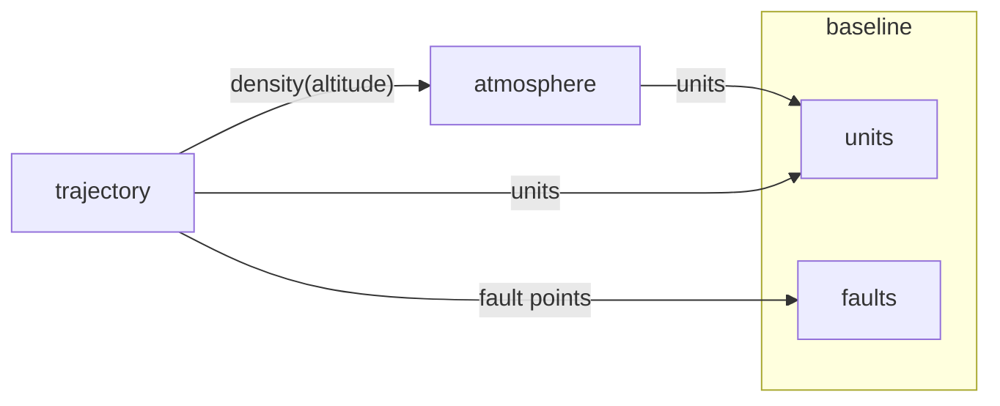

# Module map

Generated from `modules/*/manifest.yaml`. Do not edit the diagram; edit a manifest.

| Module | Responsibility | Requirements |
|---|---|---|
| atmosphere | Report air density at a geometric altitude | REQ-001, REQ-003 |
| trajectory | Integrate a point-mass projectile with drag from launch to impact | REQ-002, REQ-004, REQ-005 |
