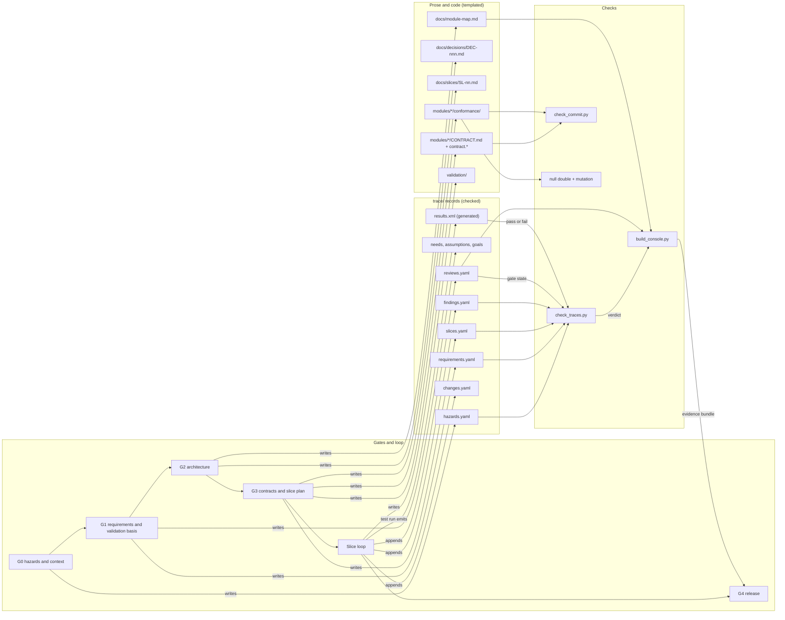

# The Artifact Map

The five gate documents each carry an Outputs table and the traceability documents say
which check reads what, so the whole picture exists only in pieces. A reader who cannot
see it whole cannot tell whether an artifact is a record, prose, or ceremony. Read by a
person orienting in a project; the console's views follow this map.

## The picture

Every gate writes records or templated prose. Every record is read by the trace
checker, which reads gate state from the review log and pass or fail from the test
results. The console renders all of it and is what the release gate receives.

## The table

| Gate | Question | Artifact | Lives in | Checked by |
|---|---|---|---|---|
| G0 | What must it never do? | Hazard records with never-statements | `trace/hazards.yaml` | `check_traces.py`: link to requirement, contract clause, test ([CORE-TRC-002](../core/traceability/trace-records.md)) |
| G1 | What must it do, and how would we know? | Requirements with verification method and validation class; needs, assumptions, goals | `trace/requirements.yaml` and siblings | `check_traces.py`: allocation, verification, validation, source |
| G2 | What are the parts? | Module map, dependency manifests, decision records, baseline list | `docs/module-map.md`, `modules/*/manifest.yaml`, `docs/decisions/` | Boundary lint against the manifests ([CORE-CON-003](../core/contracts/boundary-enforcement.md)); the diagram is generated from the manifests |
| G3 | What does each part promise? | Contracts with clause IDs, conformance suites, slice plan | `modules/*/CONTRACT.md`, `conformance/`, `docs/slices/`, `trace/slices.yaml` | Suites fail against an empty implementation and against the null double ([CORE-TST-002](../core/testing/tests-are-tested.md)); `check_commit.py` |
| Slice loop | What do I do next? | Findings, reviews, changes, validation cases, acceptance records | `trace/findings.yaml`, `reviews.yaml`, `changes.yaml`, `validation/` | `check_traces.py` with `results.xml`; mutation score; console |
| G4 | Can this be released? | Evidence bundle | The console, built from everything above | The checker over a chain with every gate row passed and every claim verified |

Where an artifact lives is decided once, in the table of
[CORE-TRC-002](../core/traceability/trace-records.md); this map only draws it.
