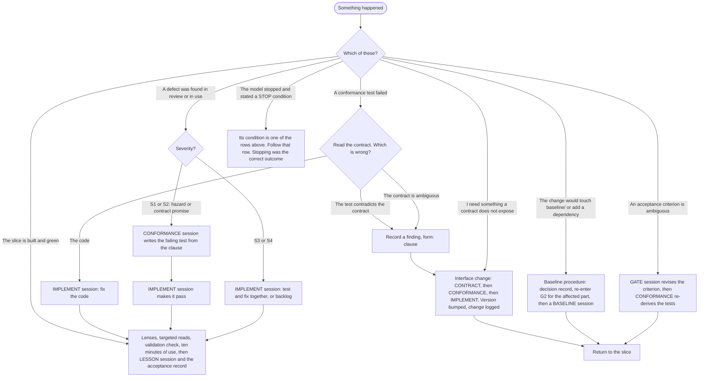

# What Do I Do Now

The README names "not knowing what to do next" as one of the three problems Hyperion
solves. The rules answer it, but from the rule's side: a person who has just watched a
test fail has to know which document to open. This answers it from the situation's side.
Read by the human at the moment something has happened and the next session type is not
obvious.

Every branch ends at a named session type. There is no branch labelled "edit the test
until it passes" or "widen the contract quietly", which is the point.

## The branches in prose

| Situation | Do | Rule |
|---|---|---|
| A conformance test failed | Read the contract, not the test. If the code is wrong, an IMPLEMENT session fixes it. If the test contradicts the contract, or the contract is ambiguous, record a finding with `form: clause` and run the Interface change | [CORE-SES-001](../core/session-protocol.md), the load-bearing prohibitions |
| You need something a contract does not expose | Interface change: CONTRACT, then CONFORMANCE, then IMPLEMENT, in three sessions. The contract version line changes; the change is logged with its driver | [CORE-CHG-001](../core/change-control/change-tiers.md) |
| The change would touch `baseline/` or add a dependency | Baseline procedure: decision record with rejected alternatives, re-enter G2 for the affected part, then a BASELINE session citing the record | [CORE-CHG-002](../core/change-control/baseline-change-procedure.md) |
| A defect was found in review or in use | Severity first. S1 or S2 is a hazard or a contract promise: a CONFORMANCE session writes the failing test from the clause, then an IMPLEMENT session makes it pass. S3 or S4: an IMPLEMENT session may write test and fix together, or it goes to the backlog | [CORE-REV-005](../core/reviews/review-findings-handling.md) |
| An acceptance criterion is ambiguous | A GATE session revises the criterion; a CONFORMANCE session re-derives the tests from it | [CORE-LFC-005](../core/lifecycle/g3-contracts.md) |
| The model stopped and stated a STOP condition | Its condition is one of the rows above. Follow that row. The stop was the correct outcome, not a failure | [CORE-SES-001](../core/session-protocol.md), declaration, stop, and escalate |
| The slice is built and green | Lenses, targeted reads, validation check against the G1 basis, ten minutes of use, then a LESSON session and the acceptance record | [CORE-LFC-006](../core/lifecycle/slice-loop.md) |

Two situations are deliberately absent. "Make the test pass" is never a branch: the
session that can edit a failing test will edit it rather than read the contract, which
is why no session type may touch both ([P8](../core/00-principles.md)). "Decide what
the criterion meant" is never a branch either: a session that finds two readings states
both and ends ([P10](../core/00-principles.md)).
