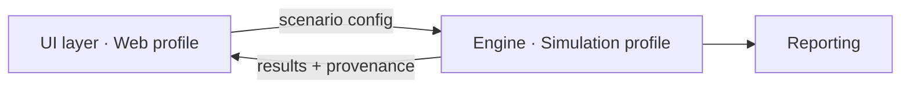

# Simulation Profile

For simulation and analysis software: physics or behaviour models, scenario
configuration, numerical output, reporting.

## The defining hazard

> **Simulation software does not crash when it is wrong. It produces plausible numbers.**

Neither "the tests pass" nor "it runs" tells you anything about correctness. Everything
in this profile follows from that. Validation is a first-class gate, not an afterthought,
and determinism is a contract-level requirement rather than a nice-to-have.

## Profile composition

Profiles compose. A simulation platform with a browser UI instantiates **Simulation +
Web**, and the contract between engine and UI is the most important interface in the
project. Name it at G2 and treat it as baseline.

Recommended split:

The engine must be runnable **headless from a config file with no UI present**. This is
not an architectural preference; it is what makes automated validation, regression
fixtures, and batch runs possible. If the engine cannot run without the UI, none of the
validation machinery in this profile works.

## Toolchain

`OPEN:` The engine language and numerical stack are not yet decided. Requires a decision
record covering: numerical library maturity, determinism guarantees, performance envelope,
model competence in the language, and the engine↔UI transport.

Candidates to assess: Python + NumPy (strongest model competence, weakest determinism
guarantees without care), Rust (strongest determinism and type-level unit safety, thinner
ecosystem, lower model competence), C++ (mature numerics, highest defect surface).

`OPEN:` UI transport — local HTTP + browser, or desktop shell. Bears on the deployment
and permissions story.

## Boundary enforcement

Per [CORE-CON-003](../../core/contracts/boundary-enforcement.md). Python is covered by
`check_boundaries.py`; another language configures its own lint in the same CI position.
The dependency manifest is the declaration in all cases. Where the language does not
carry units in the type system as Rust does, `check_units.py` is what keeps
[CORE-CON-001](../../core/contracts/contract-definition.md)'s unit types from decaying
into comments.

## Baseline additions for this profile

Beyond the core baseline list:

- **Unit and reference frame conventions.** Named, documented, encoded in types.
- **Timebase.** Fixed step or variable, and the integrator.
- **RNG policy.** See [SIM-DET-001](determinism.md).
- **Scenario configuration schema.** Versioned; scenarios are persisted data.
- **Results format and provenance schema.** See below.
- **Design tokens**, inherited from the Web profile where a UI exists.

## Provenance is mandatory output

Every result set carries: engine version, config hash, seed, timestamp, and the git
commit. Without this you cannot reproduce a result you showed someone three months ago,
and in this domain you will be asked to.

## Gate additions

| Gate | Simulation addition |
|---|---|
| G0 | Add: what decision will be made using this output, and what happens if it is wrong? |
| G1 | Validation basis is mandatory and specific — see [SIM-VAL-001](validation-basis.md) |
| G2 | Declare timebase, frames, units, RNG policy, determinism boundary |
| G3 | Every numerical contract states tolerance and stability conditions |

The G0 addition matters. A simulation whose output informs a procurement decision, an
engagement plan, or a safety case has a hazard profile; one used for a rough sanity check
does not. The mitigations differ accordingly.

## Local hazard scale

For `register: local` hazards ([CORE-LFC-002](../../core/lifecycle/g0-hazard-context.md)),
`severity` and `likelihood` are integers 1 to 3. Severity: 1, a wrong number a reader
would notice; 2, a wrong number that would survive to a brief; 3, a wrong number that
informs a decision named in the G0 addition above. Likelihood: 1, needs an unusual
scenario; 2, an ordinary scenario near the validity envelope; 3, any ordinary run.

## Targeted human reads

Replaces the core list for engine code: [SIM-RDS-001](targeted-reads.md).
